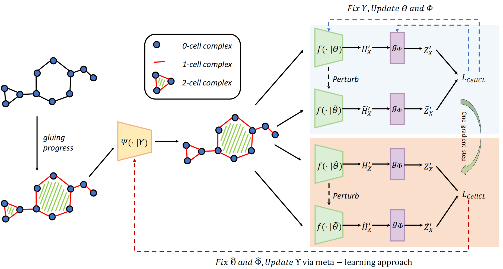

## CellCLAT
Official repository for “CellCLAT: Preserving Topology and Trimming Redundancy in Self-Supervised Cellular Contrastive Learning”

## Overview



## Environment

```shell
conda env create -f environment.yml
```
## How to run
**Unsupervised**

In project root folder, run:
```shell
bash unsupervised/shell/nci1.sh
```

**Semi-supervised**

In project root folder, run:
```shell
bash semiSupervised/shell/nci1.sh
```

## Citation